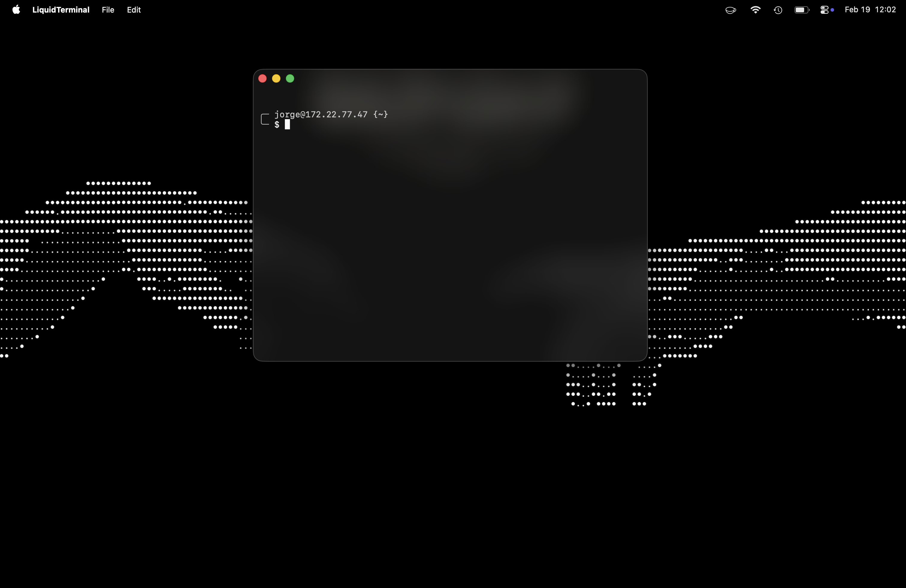

# LiquidTerminal

---AI WAS USED IN THE MAKING OF THIS PROJECT---

A modern, transparent terminal emulator for macOS built with Swift and [SwiftTerm](https://github.com/migueldeicaza/SwiftTerm).


## Preview




## Features

- 🪟 Transparent, borderless window with rounded corners
- 🎨 Native macOS look and feel using AppKit
- 🖼️ Kitty Graphics Protocol support for inline images
- ⌨️ Multi-window support (`⌘N` to open, `⌘W` to close)
- 🚀 Lightweight and fast — no Electron, no web views

---

## Prerequisites

Before building LiquidTerminal, make sure you have the following installed:

### 1. macOS 13 (Ventura) or later

LiquidTerminal requires **macOS 13.0+**. Check your version in  → About This Mac.

### 2. Xcode Command Line Tools

You need Swift and the Apple toolchain. Install them by running:

```bash
xcode-select --install
```

A dialog will appear — click **Install** and wait for it to finish.

> [!TIP]
> If you already have Xcode installed, the command line tools are included automatically.

To verify the installation:

```bash
swift --version
# Expected output: Apple Swift version 6.x or later
```

### 3. Git

Git is included with the Xcode Command Line Tools. Verify with:

```bash
git --version
```

---

## Installation

### Step 1 — Clone the repository

```bash
git clone https://github.com/jorgeMartinez293/LiquidTerminal.git
cd LiquidTerminal
```

### Step 2 — Build the project

**Debug build** (faster compilation, for development):

```bash
make build
```

**Release build** (optimized binary):

```bash
make release
```

### Step 3 — Create the App Bundle

To generate a proper macOS `.app` bundle with an icon:

```bash
make bundle
```

This will:
1. Build the project in release mode
2. Create `LiquidTerminal.app` in the project directory
3. Bundle the app icon and `Info.plist`

### Step 4 — Install the App

Move the generated app to your Applications folder:

```bash
cp -r LiquidTerminal.app /Applications/
```

You can now launch **LiquidTerminal** from Spotlight (`⌘ Space`) or from `/Applications`.

> [!NOTE]
> Since the app is not signed with an Apple Developer certificate, macOS may block it the first time. To allow it:
> 1. Open **System Settings → Privacy & Security**
> 2. Scroll down and click **"Open Anyway"** next to the LiquidTerminal message
>
> Alternatively, right-click the app → **Open** → **Open** to bypass Gatekeeper.

---

## Quick Run (without installing)

If you just want to try it without creating an app bundle:

```bash
make run
```

This builds in debug mode and launches the terminal immediately.

---

## Makefile Targets

| Command         | Description                                      |
|-----------------|--------------------------------------------------|
| `make build`    | Build in debug mode                              |
| `make run`      | Build and run immediately                        |
| `make release`  | Build optimized release binary                   |
| `make bundle`   | Build release + create `LiquidTerminal.app`      |
| `make clean`    | Remove all build artifacts                       |

---

## Uninstall

To remove LiquidTerminal:

```bash
rm -rf /Applications/LiquidTerminal.app
```

---

## Troubleshooting

### Build fails with "swift-tools-version" error

Make sure you have Swift 6.2 or later. Update Xcode to the latest version:

```bash
softwareupdate --install -a
```

### "App is damaged and can't be opened"

This is a Gatekeeper issue. Clear the quarantine attribute:

```bash
xattr -cr /Applications/LiquidTerminal.app
```

### Window appears but terminal is blank

Ensure your shell is properly configured. LiquidTerminal uses your default login shell (`$SHELL`). Check with:

```bash
echo $SHELL
```

---

## Contributing

1. Fork the repository
2. Create your feature branch (`git checkout -b feature/my-feature`)
3. Commit your changes (`git commit -m 'Add my feature'`)
4. Push to the branch (`git push origin feature/my-feature`)
5. Open a Pull Request

---

## Acknowledgments

- [SwiftTerm](https://github.com/migueldeicaza/SwiftTerm) — Terminal emulator library for Swift
